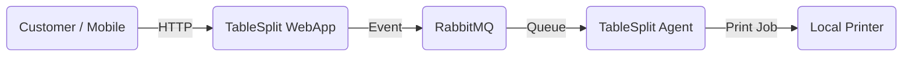

# TableSplit - Restaurant Order Management System

Welcome to the **TableSplit** repository. This project is a comprehensive solution for restaurant order management, divided into two main components integrated via messaging.

## Project Structure

The project is organized as a multi-module Maven monorepo:

*   **[`webapp/`](./webapp)**: The main application (SaaS) where customers place orders via QR Code and the restaurant manages its tables.
*   **[`agent/`](./agent)**: The "Agent" application that runs locally at the restaurant to receive orders via messaging and automatically print them on a configured printer.
*   **[`cleaner/`](./cleaner)**: An independent service executed periodically as a cron job to purge old orders from the database, respecting the multi-tenant architecture.

## Architecture

The system uses **RabbitMQ** to ensure that orders placed in the Web application reach the local Agent securely and resiliently, even in cases of internet instability at the restaurant.



## How to Run (General)

### Prerequisites
- Java 21+
- Docker & Docker Compose
- Maven 3.9+

### Local Environment
To start the database and the message broker:
```bash
docker-compose up -d
```

To build the entire project:
```bash
mvn clean install
```

For more details, please refer to the specific READMEs for each module.
